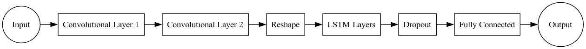
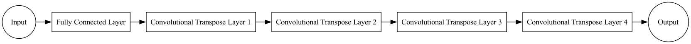
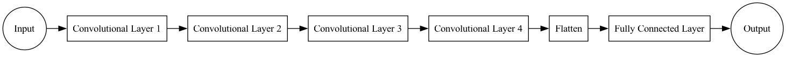
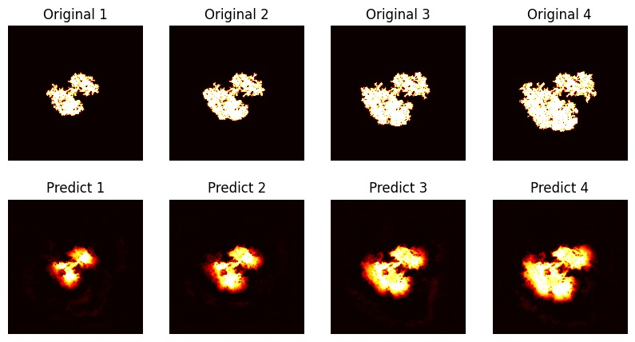
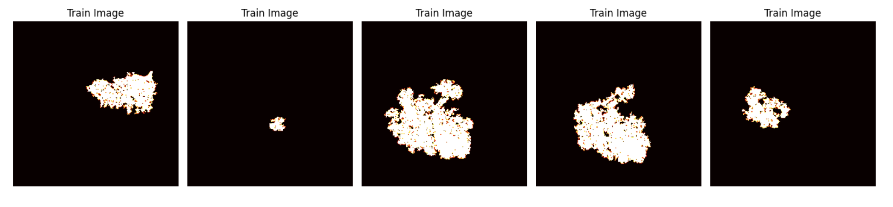
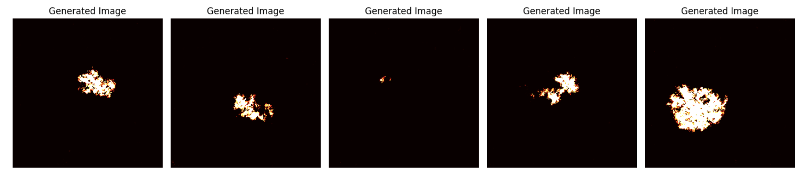
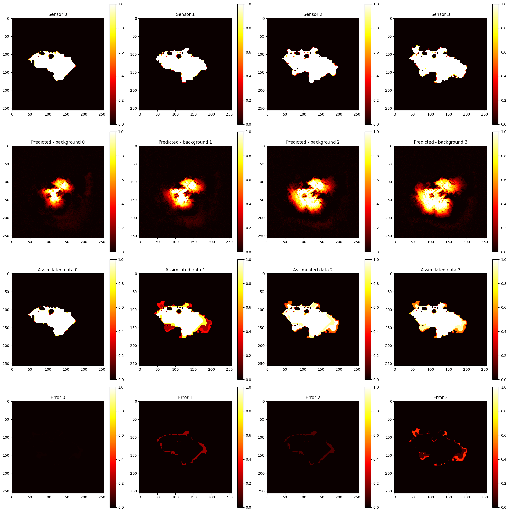
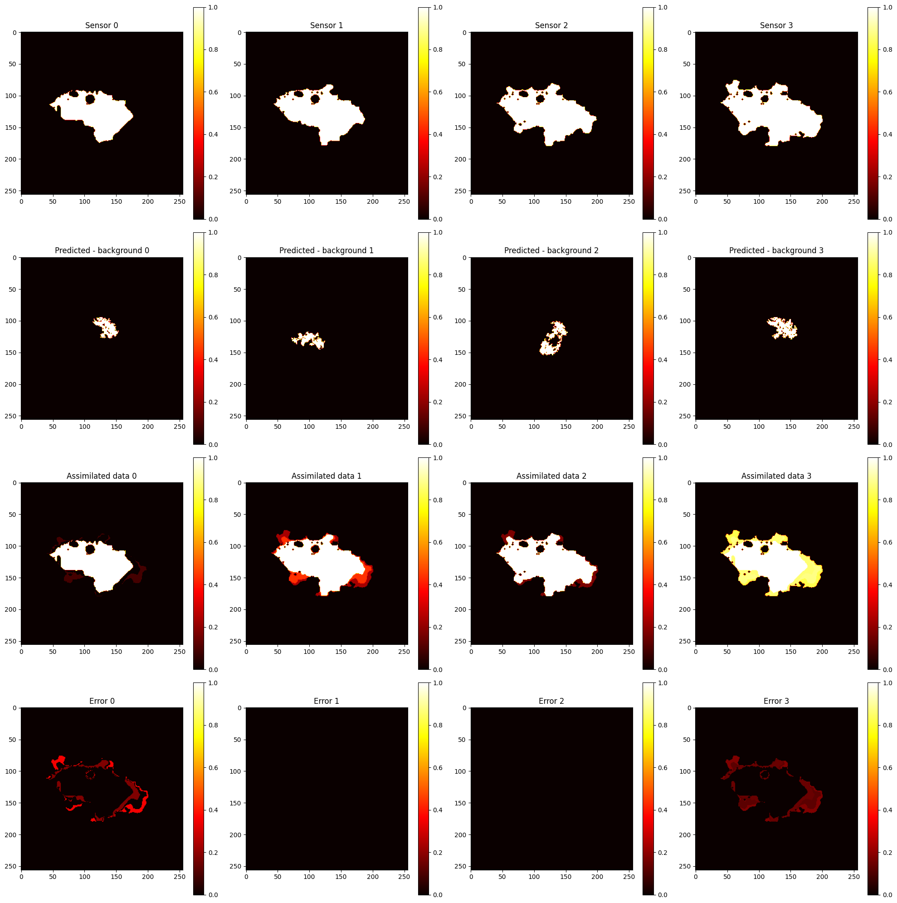

# Wildfire Prediction Project - Rush

## Overview
This project aims to develop a comprehensive system to predict wildfire behavior using advanced machine learning techniques, including Recurrent Neural Networks (RNN), Generative AI, and Data Assimilation (DA). The system leverages historical wildfire data and satellite imagery to enhance prediction accuracy and provide actionable insights.


## Data Description

- **Model Data:**
  - `Ferguson_fire_train.zip`: Training data from wildfire simulations.
  - `Ferguson_fire_test.zip`: Testing data from different wildfire simulations.
  - `Ferguson_fire_background.zip`: Background model data for DA.
- **Satellite Data:**
  - `Ferguson_fire_obs.npy`: Satellite observation data at various times after ignition.


## Objectives and Tasks

### Objective 1: Surrogate Model using RNN
- **Task 1**: Train an RNN (preferably LSTM) using `Ferguson_fire_train` and test using `Ferguson_fire_test`.
- **Task 2**: Use the RNN model with `Ferguson_fire_background` to make forecasts.
- **Task 3**: Compare forecasted results with `Ferguson_fire_obs` and calculate the Mean Squared Error (MSE).

### Objective 2: Surrogate Model using Generative AI
- **Task 1**: Train a generative model (suggested: Variational Autoencoder) with `Ferguson_fire_train` and test on `Ferguson_fire_test`.
- **Task 2**: Make forecasts using the trained generative model.
- **Task 3**: Compare forecasted results with `Ferguson_fire_obs` and calculate MSE.

### Objective 3: Correction using Data Assimilation
- **Task 1**: Compute error covariance matrices for the background and satellite data, perform DA in a reduced space.
- **Task 2**: Execute data assimilation using the results from the RNN and Generative models with `Ferguson_fire_obs` and `Ferguson_fire_background`, calculate MSE before and after DA.


## Getting Started

To run the code in this repo, please follow the steps below. 

1. Clone this repository: 

   ```python
   git clone https://github.com/ese-msc-2023/acds3-wildfire-rush.git 
   ```

2. Run commands below to install necessary libraries: 

   ```python
   cd the-directory-name-where-the-repo-is
   pip install -r requirements.txt
   ```


## Repository Structure

- **models**:
  - `ConvLSTM`: Contains the ConvLSTM models used for Objective 1.
  - `GAN`: Contains the Generative models used for Objective 2.
  
- **notebooks**: 
  - `Objective_1.ipynb`: Jupyter notebook for training and testing RNN models.
  - `Objective_2.ipynb`: Jupyter notebook for training and testing Generative models.
  - `Objective_3.ipynb`: Jupyter notebook for performing data assimilation.
  
- **tests**: 
  
  

## Models

### ConvLSTM



### GAN

**Generator:** 



**Discriminator:** 




## Model Predictions

### ConvLSTM


### GAN





## Data Assimilation

### DA for ConvLSTM

#### Error Covariance Matrices

- **Observation Error Covariance Matrix $R$: ** Computed using satellite observation data. This matrix represents the estimated errors inherent in the observational data, which help in adjusting the forecast during the data assimilation process.

- **Background Error Covariance Matrix $B$: ** Calculated using data predicted by the ConvLSTM model. This matrix describes the uncertainties associated with the initial state forecast by the model, which is crucial for the correction step in data assimilation.


Below are comparison images showing the observed data, the original predictions, the predictions after applying DA, and the error visualization between the sensor data and the predictions after DA:




### DA for GAN

#### Error Covariance Matrices

- **Observation Error Covariance Matrix $R$: ** Computed using satellite observation data. 

- **Background Error Covariance Matrix $B$: ** Calculated using data predicted by the GAN model. 


Below are comparison images showing the observed data, the original predictions, the predictions after applying DA, and the error visualization between the sensor data and the predictions after DA: 




## Authors

- Barin Odusi: [barin.odusi23@imperial.ac.uk](mailto:barin.odusi23@imperial.ac.uk)
- Bofan Liu: [bofan.liu23@imperial.ac.uk](mailto:bofan.liu23@imperial.ac.uk)
- Ce Huang: [ce.huang23@imperial.ac.uk](mailto:ce.huang23@imperial.ac.uk)
- Chawk Chamoun: [chawk.chamoun23@imperial.ac.uk](mailto:chawk.chamoun23@imperial.ac.uk)
- Georgia Ray: [georgia.ray23@imperial.ac.uk](mailto:georgia.ray23@imperial.ac.uk)
- Hanson Shen: [hanson.shen23@imperial.ac.uk](mailto:hanson.shen23@imperial.ac.uk)
- Ruoqi Li: [ruoqi.li23@imperial.ac.uk](mailto:ruoqi.li23@imperial.ac.uk)
- Yunnan Yang: [yunnan.yang23@imperial.ac.uk](mailto:yunnan.yang23@imperial.ac.uk)


## License

Please find the MIT License for this repository [here](https://github.com/ese-msc-2023/acds3-wildfire-rush/blob/main/Licence).