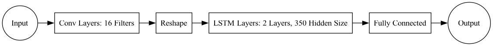
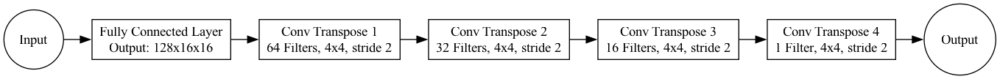
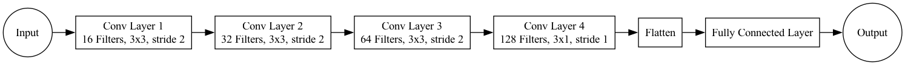

# Wildfire Prediction Project - Rush

## Overview
This project aims to develop a comprehensive system to predict wildfire behavior using advanced machine learning techniques, including Recurrent Neural Networks (RNN), Generative AI, and Data Assimilation (DA). The system leverages historical wildfire data and satellite imagery to enhance prediction accuracy and provide actionable insights.


## Data Description

- **Model Data:**
  - `Ferguson_fire_train.zip`: Training data from wildfire simulations.
  - `Ferguson_fire_test.zip`: Testing data from different wildfire simulations.
  - `Ferguson_fire_background.zip`: Background model data for DA.
- **Satellite Data:**
  - `Ferguson_fire_obs.npy`: Satellite observation data at various times after ignition.


## Objectives and Tasks

### Objective 1: Surrogate Model using RNN
- **Step 1**: Train an RNN (preferably LSTM) using `Ferguson_fire_train` and test using `Ferguson_fire_test`.
- **Step 2**: Use the RNN model with `Ferguson_fire_background` to make forecasts.
- **Step 3**: Compare forecasted results with `Ferguson_fire_obs` and calculate the Mean Squared Error (MSE).

### Objective 2: Surrogate Model using Generative AI
- **Step 1**: Train a generative model (suggested: Variational Autoencoder) with `Ferguson_fire_train` and test on `Ferguson_fire_test`.
- **Step 2**: Make forecasts using the trained generative model.
- **Step 3**: Compare forecasted results with `Ferguson_fire_obs` and calculate MSE.

### Objective 3: Correction using Data Assimilation
- **Step 1**: Compute error covariance matrices for the background and satellite data, perform DA in a reduced space.
- **Step 2**: Execute data assimilation using the results from the RNN and Generative models with `Ferguson_fire_obs` and `Ferguson_fire_background`, calculate MSE before and after DA.


## Getting Started

To run the code in this repository, please follow the steps below. 

1. Clone this repository: 

   ```bash
   git clone https://github.com/ese-msc-2023/acds3-wildfire-rush.git
   cd the-directory-name-where-the-repo-is
   ```

2. Download the necessary datasets from OneDrive: 
   - [filename](http://aaa)
   - ...

3. Extract the downloaded datasets to your project directory.

4. Create and Activate a Virtual Environment

   ```bash
   conda create --name wildfire python=3.10
   conda activate wildfire
   ```

5. Install Your Project

   With your virtual environment activated, install your project and its dependencies using the `setup.py` file: 

   ```bash
   pip install .
   ```


## Repository Structure

- **Models** 
  - `ConvLSTM`: Contains the ConvLSTM models used for Objective 1.
  - `DCGAN`: Contains the Generative models used for Objective 2.
  
- **Notebooks** 
  - `Objective_One.ipynb`: Jupyter notebook for training and testing ConvLSTM models.
  - `Objective_Two.ipynb`: Jupyter notebook for training and testing Generative models.
  - `Objective_Three.ipynb`: Jupyter notebook for performing data assimilation.
  
- **Tests**
  - `test_1.py`: Contains automated tests to validate the accuracy and performance of the functions and models used in Objective 1, primarily focusing on the ConvLSTM model.
  - `test_2.py`: Includes tests for verifying the functionality and effectiveness of the Generative models employed in Objective 2.
  - `test_3.py`: Features tests to ensure the correct implementation and results of data assimilation processes outlined in Objective 3.

- **Images**
  - Directory containing images and diagrams used in the documentation.

- **Packages**
  - `setup.py`: Setup script for installing the project as a package.
  - `requirements.txt`: List all dependencies that need to be installed using pip to ensure the project runs correctly.

- **License**
  - `LICENSE`: The license file that specifies the permissions, limitations, and conditions under which the software can be used.
  

## Model Structure

### ConvLSTM



### GAN

**Generator:** 



**Discriminator:** 




## Model Predictions

### ConvLSTM

The image below shows a comparison between the original data and the predictions made by the ConvLSTM model. This visualization helps to highlight the model's accuracy and capability in predicting wildfire behaviour.


### GAN

The following images display the training results and predictions from GAN model. These comparisons demonstrate how the GAN model captures and replicates the complex patterns of wildfire data, providing a visual assessment of its predictive performance. 


## Data Assimilation

### DA for ConvLSTM

#### Error Covariance Matrices

- Observation Error Covariance Matrix $R$:  Computed using satellite observation data. This matrix represents the estimated errors inherent in the observational data, which help in adjusting the forecast during the data assimilation process.

- Background Error Covariance Matrix $B$:  Calculated using data predicted by the ConvLSTM model. This matrix describes the uncertainties associated with the initial state forecast by the model, which is crucial for the correction step in data assimilation.

#### Model and Data Assimilation Visualization

Below are comparison images showing the observed data, the original predictions, the predictions after applying DA, and the error visualization between the sensor data and the predictions after DA:


### DA for GAN

#### Error Covariance Matrices

- Observation Error Covariance Matrix $R$:  Computed using satellite observation data. 

- Background Error Covariance Matrix $B$:  Calculated using data predicted by the GAN model. 

#### Model and Data Assimilation Visualization

Below are comparison images showing the observed data, the original predictions, the predictions after applying DA, and the error visualization between the sensor data and the predictions after DA: 


## Tests

To ensure the code is working correctly, you can run the provided tests. Follow the steps below to set up your testing environment and execute the tests.

### Prerequisites

Make sure you have all necessary dependencies installed. Make sure the environment is activated.


### Running the Tests
We use pytest as our testing framework. To run the tests, follow these steps:

1. Navigate to the project directory: Ensure you are in the root directory of the project where the test folder is located: 

   ```bash
   cd path/to/your/project
   ```

2. Activate the 'wildfire' environment: 

   ```bash
   conda activate wildfire
   ```

3. Run the tests: 

   ```bash
   pytest test
   ```


### Common Issues
`ModuleNotFoundError`: If you encounter a `ModuleNotFoundError`, ensure that you have activated the correct virtual environment and all required packages are installed.

  ```bash
  conda activate wildfire
  pip install -r requirements.txt
  ```


## License

Please find the MIT License for this repository [here](https://github.com/ese-msc-2023/acds3-wildfire-rush/blob/main/Licence).


## Authors

- Chawk Chamoun: [chawk.chamoun23@imperial.ac.uk](mailto:chawk.chamoun23@imperial.ac.uk)
- Ce Huang: [ce.huang23@imperial.ac.uk](mailto:ce.huang23@imperial.ac.uk)
- Ruoqi Li: [ruoqi.li23@imperial.ac.uk](mailto:ruoqi.li23@imperial.ac.uk)
- Bofan Liu: [bofan.liu23@imperial.ac.uk](mailto:bofan.liu23@imperial.ac.uk)
- Barin Odusi: [barin.odusi23@imperial.ac.uk](mailto:barin.odusi23@imperial.ac.uk)
- Georgia Ray: [georgia.ray23@imperial.ac.uk](mailto:georgia.ray23@imperial.ac.uk)
- Hanson Shen: [hanson.shen23@imperial.ac.uk](mailto:hanson.shen23@imperial.ac.uk)
- Yunnan Yang: [yunnan.yang23@imperial.ac.uk](mailto:yunnan.yang23@imperial.ac.uk)


